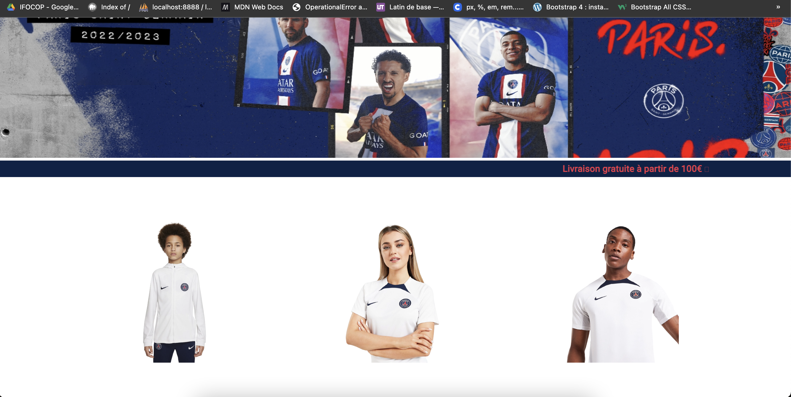

# README

Ce projet est une réplique du site du psg, avec une partie actualité, effectif et la partie e-boutique jusqu'au paiement via paypal. 

Ce projet comprend : 

- Un serveur Django (web backend)
- Un serveur Angular (web frontend)

### Page d'accueil : 


##### <center> *Fig.1 page d'accueil* </center> <br>


### Landing page : 


##### <center> *Fig.2 landing page* </center> <br>

### Actualité : 


##### <center> *Fig.3 page d'actualité* </center> <br>


### Effectif : 


##### <center> *Fig.4 page de l'effectif* </center> <br>

### Palmarès : 


##### <center> *Fig.5 page du palmares* </center> <br>

### Boutique : 



##### <center> *Fig.6 page de la boutique* </center> <br>


## 1. Installation

Dans un premier temps, vous devez cloner le dossier avec la commande suivante : 

```bash
$ git clone <repository>
```

Puis installez Node package avec la commande suivante : 

```bash
npm install
```

## 2. Lancement 

Le projet se lance avec deux terminaux (front et back).

Le front avec les commande suivantes : 

```bash
cd front
ng serve
```

Le back avec les commandes suivantes : 

```bash
cd backend
python3 manage.py runserver
```

Puis ouvrez votre navigateur à l'adresse : 

http://localhost:4200/